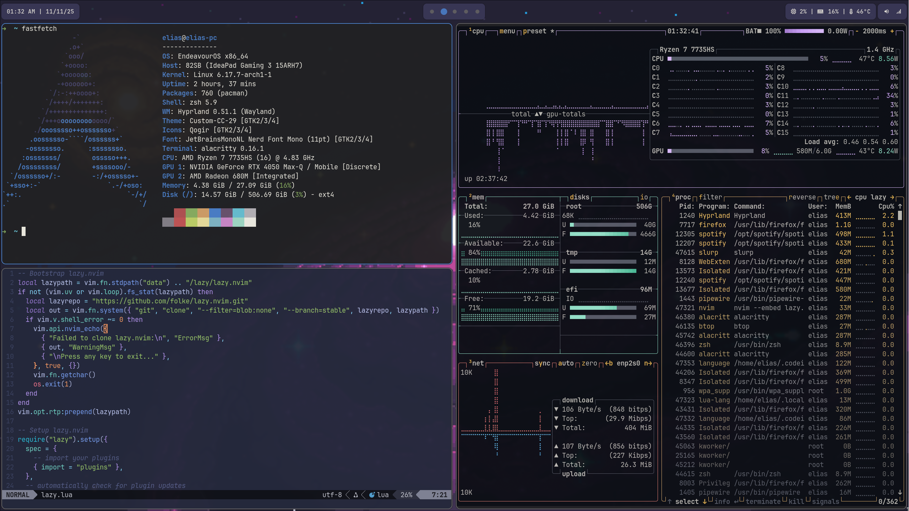
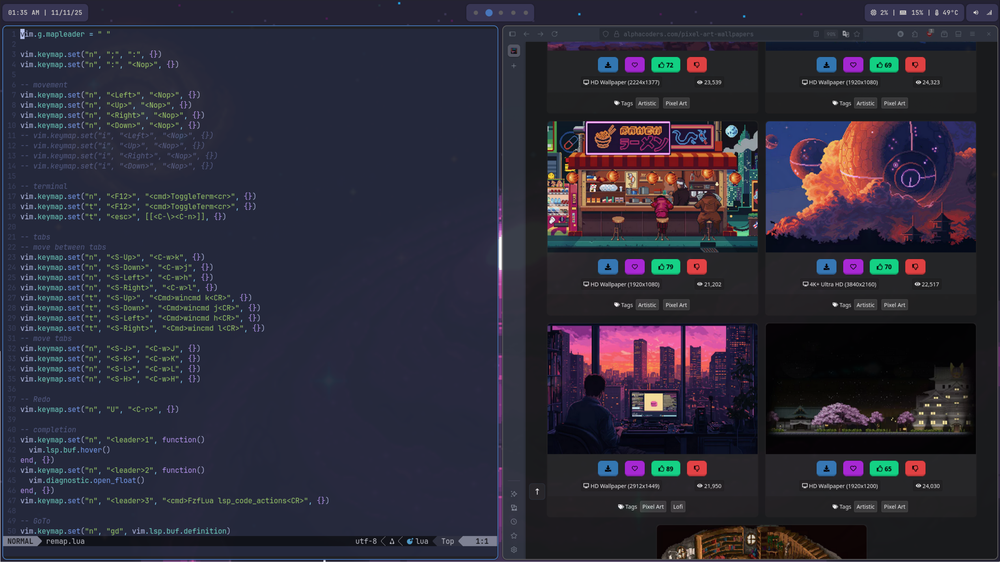
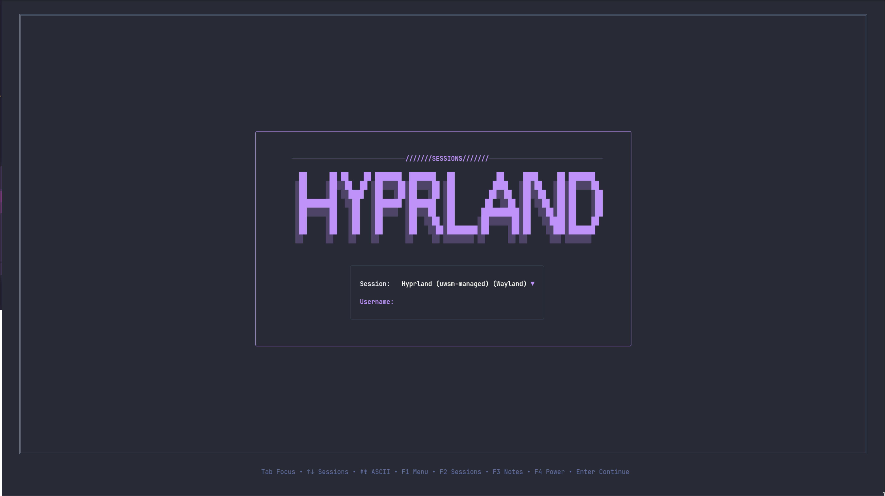
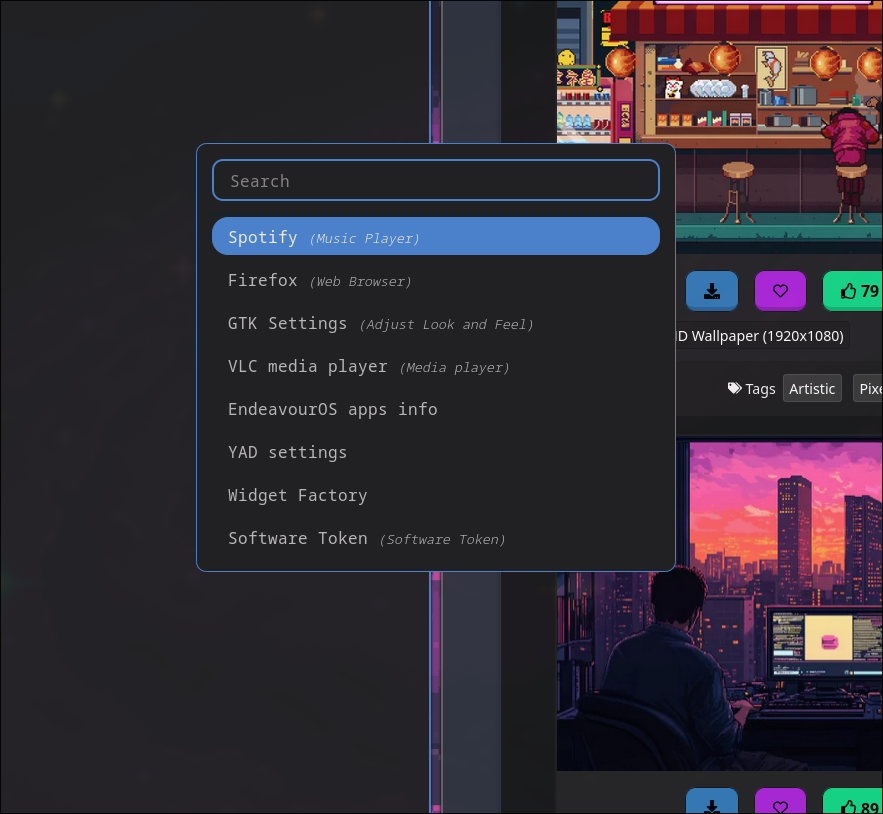
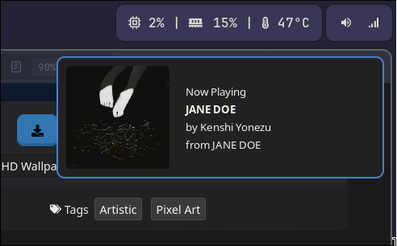

# My dotfiles

Config :
- [EndeavorOS](https://endeavouros.com/)
- [Hyprland](https://github.com/hyprwm/Hyprland)
- [Wayland](https://wayland.freedesktop.org/)
- [Waybar](https://github.com/Alexays/Waybar)
- [Alacritty](https://github.com/alacritty/alacritty)
- [Dunst](https://github.com/dunst-project/dunst)
- [Rofi](https://github.com/DaveDavenport/rofi)
- [Neovim](https://github.com/neovim/neovim)
- [Zsh](https://github.com/ohmyzsh/ohmyzsh)
- [Greetd](https://git.sr.ht/~kennylevinsen/greetd)

## Screenshots
### Waybar

### Desktop

### Fastfetch + btop + nvim

### Nvim + firefox

### Lock Screen Greetd

### rofi

### Custom Spotify Notification

